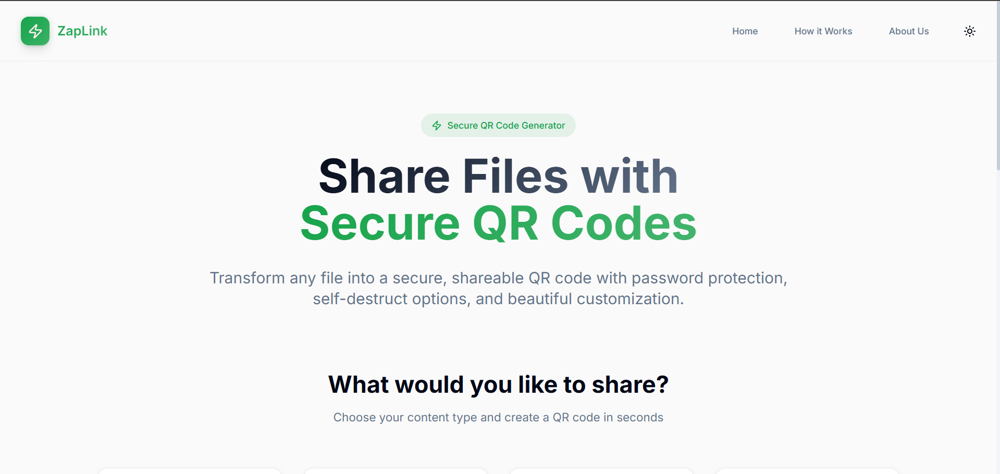
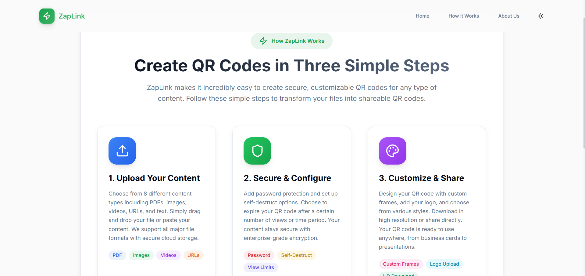
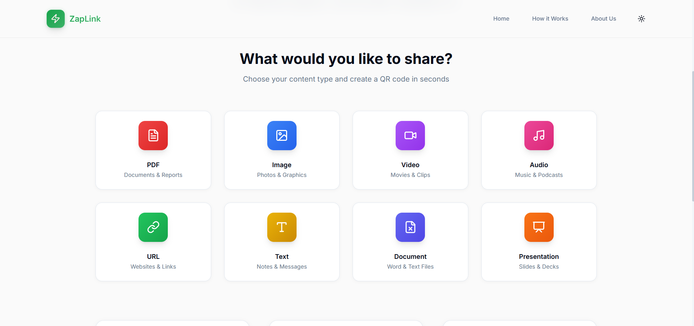

# Zaplink — Secure QR Code & File Sharing Platform-testing

> ⚠️ **IMPORTANT**: This frontend requires a **backend server** running to work properly. See [BACKEND_SETUP.md](BACKEND_SETUP.md) for detailed instructions.

## 🎯 About This Project

Zaplink is an open-source platform that lets you transform any file, link, or text into a **secure, shareable QR code** — instantly. Whether it's a PDF report, a video, an image, or a URL, Zaplink wraps it in a unique short link and QR code that you can share anywhere.

Every "Zap" (your uploaded content) can be locked with a **password** and configured to **self-destruct** after a set number of views or a time limit — making it ideal for sensitive, time-critical content sharing.

Zaplink also lets you **customize your QR code** with frames, logos, and styles before downloading or sharing it. It's built with React, TypeScript, Vite, and Tailwind CSS, and is maintained by **GDG CHARUSAT** as part of their open-source learning initiative.

## ✨ Features

- 📁 **Multi-format Support** — Upload PDFs, images, videos, audio, documents, presentations, ZIP archives, URLs, and plain text
- 🔐 **Password Protection** — Lock any Zap with a password so only authorized people can access it
- 💣 **Self-Destruct** — Set a view-count limit or an expiry time after which the link stops working automatically
- 🎨 **QR Code Customization** — Choose from frame styles (rounded, circle, shadow, gradient, border) and embed your own logo
- ⚡ **Instant QR Generation** — Get a QR code and short link in seconds, no registration required
- 🌗 **Dark/Light Mode** — Full theme toggle support for a comfortable experience
- 📱 **Fully Responsive** — Works seamlessly on mobile, tablet, and desktop

## 📸 Screenshots

### Home — Choose What to Share


### Step-by-Step Upload Flow


### Things You Can Share


---

## 🚀 Quick Start for Contributors

### Prerequisites

- Node.js (v18 or higher)
- npm
- Git
- **Backend Server** (REQUIRED - must be running before testing uploads)

### Installation & Setup

#### Step 1: Clone & Install Frontend
```bash
# Fork and clone your fork
git clone https://github.com/YOUR-USERNAME/Zaplink_frontend.git
cd Zaplink_frontend

# Add upstream remote
git remote add upstream https://github.com/gdg-charusat/Zaplink_frontend.git

# Install dependencies
npm install
```

#### Step 2: Get the Backend Running (CRITICAL!)

The frontend **REQUIRES** a backend server running on `http://localhost:5000` for uploads to work.

##### Option A: Backend in Sibling Directory (Recommended)
```bash
# In a NEW terminal, from parent directory
cd ..
git clone https://github.com/gdg-charusat/Zaplink_backend.git
cd Zaplink_backend

# Install and start backend
npm install
npm start
```

✅ Backend should now be running on `http://localhost:5000`

##### Option B: Backend on Different Port
Create `.env` file in frontend directory:
```env
VITE_BACKEND_URL=http://localhost:3000
```

Replace `3000` with your actual backend port, then start frontend.

##### Option C: Using Docker
```bash
cd ../Zaplink_backend
docker build -t zaplink-backend .
docker run -p 5000:5000 zaplink-backend
```

#### Step 3: Start Development Frontend

In the `Zaplink_frontend` directory (in a NEW terminal):
```bash
npm run dev
```

✅ Frontend will open at `http://localhost:5173`

### ✓ Verify Setup is Correct

Open browser DevTools (F12) and check the console:

**✅ Success - You should see:**
```
ℹ Development Mode: Using Vite proxy for /api routes
📍 Proxy target: http://localhost:5000 (default)
```

**❌ Error - If you see:**
```
Failed to load resource: the server responded with a status of 500 (Internal Server Error)
AggregateError [ECONNREFUSED]
```

**This means:** Backend is NOT running! Follow Step 2 again.

### 🛠 Troubleshooting

| Problem | Solution |
|---------|----------|
| **Upload returns 404** | Backend not running. Start it: `cd ../Zaplink_backend && npm start` |
| **ECONNREFUSED error** | Backend not running on port 5000. Check `npm start` output in backend terminal |
| **Backend on different port** | Create `.env`: `VITE_BACKEND_URL=http://localhost:YOUR_PORT` |
| **"Cannot find module" errors** | Run `npm install` in both frontend AND backend |
| **Port 5000 already in use** | Either kill that process or use a different port with `.env` config |

### 📝 Common Development Flow

```bash
# Terminal 1: Backend
cd ../Zaplink_backend
npm start
# Should show: Server running on http://localhost:5000

# Terminal 2: Frontend  
cd ../Zaplink_frontend
npm run dev
# Should show: Local: http://localhost:5173
```

### 🔄 After Changes

- **Frontend changes**: Automatically reload in browser
- **Backend changes**: Restart the backend server (Ctrl+C, then `npm start`)

---

## 📚 Contributing

We welcome contributions from developers of all skill levels! Please read our [CONTRIBUTING.md](CONTRIBUTING.md) guide to get started.

### Finding Issues

Browse our [Issues](https://github.com/gdg-charusat/Zaplink_frontend/issues) page for tasks:

- **Beginner** 🟢: Look for `good-first-issue` or `beginner` labels
- **Intermediate** 🟡: Look for `intermediate` label

### Contribution Workflow

1. Pick an issue and comment to get assigned
2. Create a new branch: `git checkout -b feature/your-feature-name`
3. Make your changes
4. Commit: `git commit -m "feat: add feature description"`
5. Push: `git push origin feature/your-feature-name`
6. Open a Pull Request

Need help? Check out our detailed [CONTRIBUTING.md](CONTRIBUTING.md) guide!

---

## 🛠 Tech Stack

- **React 18** - UI library
- **TypeScript** - Type safety
- **Vite** - Build tool & dev server
- **Tailwind CSS** - Utility-first CSS
- **Shadcn/ui** - Component library

---

## 📁 Project Structure

```
Zaplink_frontend/
├── src/
│   ├── components/      # Reusable React components
│   ├── pages/          # Page components
│   ├── hooks/          # Custom React hooks
│   ├── utils/          # Helper functions
│   ├── types/          # TypeScript type definitions
│   ├── styles/         # Global styles
│   └── assets/         # Static assets (images, fonts)
├── public/             # Public static files
├── CONTRIBUTING.md     # Contribution guidelines
└── README.md           # This file
```

---

## 🧪 Available Scripts

```bash
# Start development server
npm run dev

# Build for production
npm run build

# Preview production build
npm run preview

# Run linter
npm run lint
```

---

## 🤝 Community

- **Event**: GDG CHARUSAT Open Source Contri Sprintathon
- **Discord/WhatsApp**: [Link to community group]
- **Maintainers**: [List maintainer GitHub usernames]

---

## 📜 Code of Conduct

Please read our [Code of Conduct](CODE_OF_CONDUCT.md) to understand the expected behavior in our community.

---

## 📝 License

[Add your license here]

---


## 🌟 Contributors

Thanks to all our amazing contributors!

<!-- Add contributor badges or list here -->-

---

## 📞 Need Help?

- 📖 Check the [CONTRIBUTING.md](CONTRIBUTING.md) guide
- 💬 Comment on the issue you're working on
- 🗣️ Ask in the event Discord/WhatsApp group
- 🐛 Found a bug? [Create an issue](https://github.com/gdg-charusat/Zaplink_frontend/issues/new)

---

**Happy Coding! 🚀**

Made with ❤️ by GDG CHARUSAT
